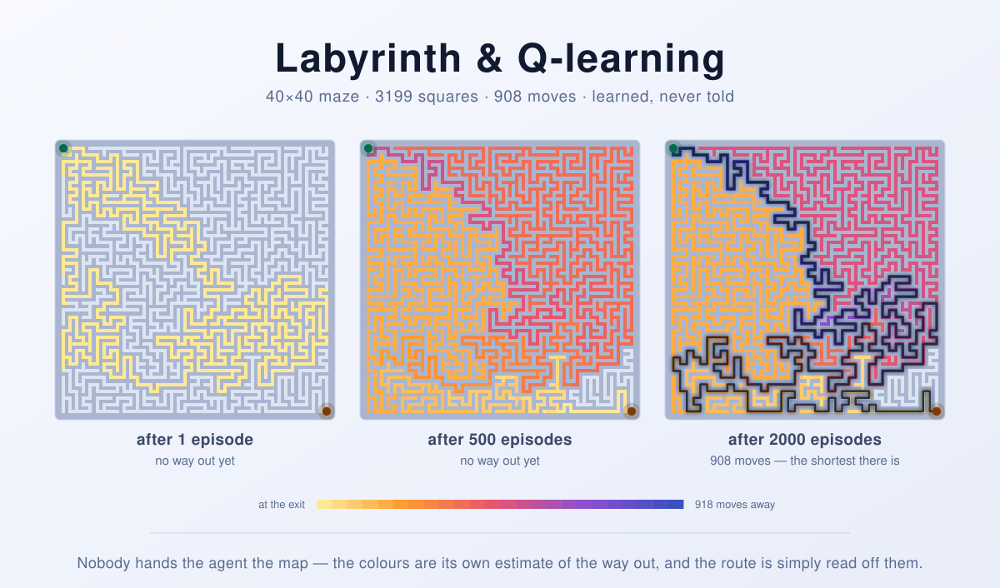

Labyrinth & Q-learning
======================

A maze, solved twice over — once by an agent that has to discover it a bump at
a time, and once by a search that is simply handed the map.

The maze in this repository is forty cells square: sixteen hundred rooms joined
by exactly one route between any two of them, which means there is precisely
one way to walk from the top-left corner to the bottom-right, and it is nine
hundred and eight moves long. A breadth-first search finds it in a fifth of a
second, and that is the boring half of the story. The interesting half is an
agent that is shown none of this. It starts in the corner knowing only that it
can try to move up, down, left or right; walls announce themselves by refusing
to let it through; the exit is not marked, and nothing tells it when it is
getting warm. All it keeps is a table of guesses — one number per room per
direction — that it revises after every single step. Two thousand walks later
the guesses have arranged themselves into something that is, in effect, a map
of the whole labyrinth, and the agent walks the nine hundred and eight moves
without a wrong turn. This repository keeps the search as well as the learner,
because the search is what proves the learner got it exactly right rather than
merely nearly right.

<picture>
  <source media="(prefers-color-scheme: dark)" srcset="docs/banner-dark.svg">
  
</picture>

*(The banner is not decoration: every colour in it came out of a real training
run of the code in this repository. Each square is tinted by how far the agent
believes it is from the exit at that point in its education, and the route in
the last panel is what those beliefs add up to.)*

As seen in the article
[Reinforcement learning (RF) with Python](https://oskarj.wordpress.com/2023/01/23/reinforcement-learning-rf-with-python/).

## Problem definition

A labyrinth is a grid of squares. Some are corridor, some are wall. An agent
starts on the first open square and wants to reach the last one.

It is not given the grid. At each step it chooses one of four moves — up,
down, left, right — and the world answers. If the target square is open, the
agent is now standing on it. If it is wall, or off the edge, the agent is
standing exactly where it was, one move poorer. That is the whole of the
feedback: no map, no compass, no "warmer, colder", and no announcement of the
exit until it is reached.

Find the way out, and then find the *shortest* way out.

Two mazes ship with the repository. The default is the 5×5 grid this project
started with, small enough to check by eye. The other is `df_maze.png`, a
40×40 perfect maze — one produced by a depth-first "recursive backtracker"
generator, so every cell is reachable and no cell is reachable two ways —
drawn as a 504×504 picture that the program has to read before it can walk it.

## Requirements

**Python 3.10 or newer** — tested up to 3.13, and nothing here is expected to
break on later versions. No third-party packages, no build step, nothing to
install. The 2023 version of this repository needed `numpy`, `tqdm` and
`opencv-python`; none of the three is needed now, including for reading the
PNG.

Older interpreters are not supported. On Python 3.9 and below the script fails
at import with `TypeError: dataclass() got an unexpected keyword argument
'slots'`, and would fail a few lines later anyway on parameters written as
`list[str] | None` — the `X | Y` union syntax
([PEP 604](https://peps.python.org/pep-0604/)) only became valid at runtime in
3.10.

Check what you have with `python --version`, and mind that on many systems
`python` and `python3` point at different interpreters.

## Running it

```
python maze_rl.py
```

Options:

| Flag | Meaning |
| --- | --- |
| `-i PNG`, `--image PNG` | Read the maze from a picture instead of using the built-in 5×5 grid. |
| `-m M`, `--method M` | `q-learning` (default) or `bfs`, which skips the learning entirely. |
| `-e N`, `--episodes N` | How many walks the agent gets (default: `2000`). |
| `-a F`, `--alpha F` | Learning rate (default: `0.8`). |
| `-g F`, `--gamma F` | Discount factor (default: `1.0` — see below). |
| `--epsilon F` | Chance of a random move at the first episode (default: `0.2`). |
| `--epsilon-final F` | The same at the last episode; it fades linearly (default: `0.01`). |
| `--step-limit N` | Steps allowed per episode (default: six per open square). |
| `--threshold B` | Brightness at which an image pixel counts as corridor (default: `128`). |
| `-s N`, `--seed N` | Seed for the agent's random choices (default: `0`). |
| `--ascii` | Draw with `#` and `.` instead of box-drawing characters. |
| `-v`, `--verbose` | Report every training episode on stderr. |
| `-h`, `--help` | Show usage. |

The drawing goes to **stdout** and every summary line to **stderr**, so the
maze stays easy to redirect:

```
$ python maze_rl.py --ascii 2>/dev/null
S
.# #
.# #
.# #
....G
```

The lines you just threw away are the ones that say whether it worked:

```
$ python maze_rl.py >/dev/null
maze: 5 x 5 squares, 19 of them open; (0, 0) -> (4, 4)
breadth-first search: 8 moves
Q-learning: 2000 episodes in 0.0s (alpha=0.8, gamma=1.0, epsilon 0.2 -> 0.01, seed 0)
learned policy: 8 moves -- the shortest route there is
```

The real maze takes a few seconds, and lands on the same verdict:

```
$ python maze_rl.py -i df_maze.png >/dev/null
maze: 81 x 81 squares, 3199 of them open; (1, 1) -> (79, 79)
breadth-first search: 908 moves
Q-learning: 2000 episodes in 7.0s (alpha=0.8, gamma=1.0, epsilon 0.2 -> 0.01, seed 0)
learned policy: 908 moves -- the shortest route there is
```

...with the route drawn through it, in a corner of the picture:

```
████████████████████████████████████████████████████
█S█·····█                           █             █
█·█·███·█████ █████ █████████ █████ █ █████████ █ ██
█···█ █·····█ █···█     █   █ █   █ █ █     █   █
█████ █████·███·█·███████ █ █ █ ███ █ █ ███ █ ██████
█         █·····█·█·····█ █   █ █   █ █ █     █   █
█ ███ ███ ███████·█·███·█ █████ █ ███ █ ███████ █ █
█ █   █   █     █·█···█·█     █     █ █   █     █ █
```

Exit code `0` means the learned policy walked out; `1` means it got lost and
wants more episodes; `2` means the arguments or the image were bad. Watching it
learn is `-v`:

```
$ python maze_rl.py -e 6 -v >/dev/null
episode      1/6:     114 steps, epsilon 0.200, gave up
episode      2/6:      36 steps, epsilon 0.162, reached the goal
episode      3/6:      35 steps, epsilon 0.124, reached the goal
episode      4/6:      28 steps, epsilon 0.086, reached the goal
episode      5/6:      20 steps, epsilon 0.048, reached the goal
episode      6/6:      27 steps, epsilon 0.010, reached the goal
```

## How it learns, and why it works

The agent keeps one number for every (square, direction) pair, written
`Q(s, a)`: its current guess at the total reward it will collect if it moves in
direction `a` from square `s` and behaves sensibly afterwards. After every
single step it revises that one number towards what the step actually showed
it:

```
Q(s, a)  ←  Q(s, a) + α · [ r + γ · max Q(s', a')  −  Q(s, a) ]
                                   a'
```

The bracket is the surprise: what the step turned out to be worth, minus what
the table had predicted. `α` decides how much of the surprise to believe. This
is [Q-learning](https://en.wikipedia.org/wiki/Q-learning), and there are only
three design decisions in it that matter.

**A move costs one, and the exit pays nothing.** Every step scores `−1`,
including a step into a wall — the agent stays put, and it has still burned a
move. Reaching the goal ends the episode and pays no bonus at all. That sounds
backwards until you notice what it makes `Q` mean: the value of a square is
minus the number of moves still to go, so "collect as much reward as possible"
and "get out in as few moves as possible" become the *same sentence*. A reward
for arriving would work too, but this way there is nothing to tune.

**The discount stays at 1.** `γ` shrinks the value of everything that happens
later. A discount below 1 is normally harmless, and here it quietly destroys
the problem: with `γ = 0.95`, a square's value is `−20·(1 − 0.95ᵈ)` where `d` is
its distance from the exit, and by `d ≈ 650` the ᵈ-th power has fallen so far
below double precision that neighbouring squares get *bit-identical* values.
On this maze `d` reaches 918:

```python
>>> value = lambda d, g: -(1 - g**d) / (1 - g)
>>> value(908, 0.95) == value(907, 0.95)
True                       # 908 moves out and 907 moves out look the same
>>> value(908, 0.99) == value(907, 0.99)
False
```

There is nothing for the agent to follow downhill, and it never converges —
try `-g 0.95` and watch it fail with any number of episodes you like. At
`γ = 1` the difference between one square and the next is exactly 1, which is
the whole point. (The 2023 version used `γ = 0.95`, which was survivable on the
5×5 grid and hopeless on this one.)

**Nothing gets initialised pessimistically.** The table starts at zero, and
every true value is negative, so an untried direction always looks better than
a tried one. That single fact is the exploration engine: the agent is drawn
towards whatever it has not done yet, and sweeps the maze systematically rather
than loitering near the start. The `ε`-greedy random moves on top (20% at the
start, 1% by the end) are a garnish, not the main course.

The rest is bookkeeping. Episodes are cut off after six steps per open square,
because the first few are close to random walks and would run for a couple of
hundred thousand steps if you let them; truncating them costs nothing, since Q-learning learns from
individual steps rather than from finished episodes, and it makes training
about ten times quicker.

**And the answer.** For this maze — one route between any two cells — the
shortest way out is also the *only* way out, so 908 moves is not "a good
score", it is the route walked without a single wrong turn. Breadth-first
search says 908. The learner says 908. That agreement, between a method that
was given the map and one that was given nothing, is the entire test suite this
repository needs.

## Reading a maze out of a picture

`df_maze.png` is 504×504 pixels of black and white. The tempting move — the one
the 2023 version made — is to call each pixel a square and let the agent walk
the bitmap. It does not work, and it is instructive about why.

A picture of a maze is drawn on a **lattice**: walls only ever appear along a
fixed set of columns and rows, spaced one cell apart. Count the dark pixels in
each column of the image and the lattice falls out immediately — a column
carrying walls is far darker than one running down the middle of a corridor,
because even a wall-free lattice column still collects every junction it
crosses. The same for rows. Forty-one lines each way, which is a 40×40 maze;
the midpoint between two lines is a cell, and whether two neighbouring cells
are joined is decided by the single pixel on the line between them.

Recovering the lattice first is not a nicety, it is the difference between a
tractable problem and a hopeless one:

|  | states in the table | states worth having | moves to the exit |
| --- | --- | --- | --- |
| pixels (the 2023 version) | 254 016 | 143 494 | 4 943 |
| cells and their doorways | 6 561 | 3 199 | 908 |

The Q-table shrinks from a million entries to twenty-six thousand, and the
number of moves the agent has to get right in a row drops by a factor of five.
The original notebook recorded `100/100 [24:52<00:00, 14.92s/it]` — twenty-five minutes to
not solve it. This version reads the image, learns the maze and prints the
route in about seven seconds.

The PNG reader is thirty lines of `zlib` plus the un-filtering rules from
section 9 of the PNG specification. Pulling in OpenCV — ninety megabytes of
computer-vision library — to threshold a black-and-white picture was the
single largest dependency in the old `requirements.txt`.

## Other ways to solve it

Q-learning is the *least informed* way to get through a maze, which is exactly
why it is worth watching. Five approaches, from the one that assumes least to
the one that assumes most:

**1. Model-free reinforcement learning — millions of steps.** *(what
`maze_rl.py` does)*
The agent has no model of the maze and never builds one; it only ever adjusts
the number attached to the move it just made. It needs to physically walk every
corridor many times over — about eight million steps here — but it would work
just as well on a maze whose walls moved, or a robot whose motors slip, and
that is what the price buys. Its on-policy sibling **SARSA** replaces
`max Q(s', a')` with the value of the action actually taken next; on a maze
with no penalty for risk the two agree, which is why the classic demonstration
of the difference is a cliff rather than a labyrinth.

**2. Learn a model, then dream — thousands of real steps.**
Nothing stops the agent from *remembering* that "moving north from square 412
led to square 331". **Dyna-Q** stores those transitions and replays them
between real moves, so a single walk down a corridor can be re-learned from a
hundred times over without moving. **Prioritized sweeping** is the same idea
with a queue: replay the transitions whose values just changed the most, which
on a maze means the update spreads backwards from the exit like a wave instead
of seeping. Same final answer, one or two orders of magnitude fewer real steps.

**3. Value iteration — a few dozen sweeps.**
If you are willing to look at the map, drop the walking. Sweep the whole grid
repeatedly, setting each square's value to `−1 +` the best of its neighbours',
until nothing changes. This is the dynamic-programming skeleton that
Q-learning is a sampled, model-free approximation of, and it converges in as
many sweeps as the maze is deep:

```python
values = {square: 0.0 if square == goal else -float("inf") for square in open_squares}
for _ in range(918):                       # the depth of this maze, worst case
    for square in open_squares:            # `neighbours` returns the open ones
        if square != goal:
            values[square] = -1 + max(values[n] for n in neighbours(square))
```

Each sweep settles one more ring of squares around the exit, so the bound is
the depth of the maze; in practice this one stops changing after 533 sweeps,
and `values[start]` is `-908`.

**4. Breadth-first search — one pass, exact.** *(the oracle in `maze_rl.py`)*
Every move costs the same, so the first time a search reaches a square it has
reached it by the fewest possible moves. One visit per square, no iteration, no
parameters, provably optimal. **A\*** is the same search told roughly which way
the exit lies — with a Manhattan-distance heuristic it opens a fraction of the
squares — and **Dijkstra** is what you reach for the moment the moves stop
costing the same.

**5. Keep your left hand on the wall — no memory at all.**
The oldest method, and it needs neither map nor table: in a maze whose walls
are all connected to the outer boundary, following one wall gets you out.
**Trémaux's rule** (mark each corridor as you leave it, never take a corridor
marked twice) works in any maze whatsoever, using only chalk. Neither gives the
*shortest* route — the left-hand rule gets out of this maze in 3 048 moves
against the optimal 908 — but neither needs to have seen the maze before, or to
remember it afterwards, and one of them will get a person out of a hedge maze
without a Q-table.

The learner earns its place anyway. It is the only entry on the list that
requires no privileged access to the world it is solving, and the maze is the
smallest honest place to watch that happen.

### If you did want it to scale

Tabular anything is finished the moment the state space stops fitting in
memory, and 3 199 squares is a toy. Two escape routes, in order of ambition.

Vectorise the sweep. Approach 3 above is a handful of array operations, and
`numpy` does the whole grid at once instead of one square at a time:

```python
import numpy as np

def solve(open_mask: np.ndarray, goal: tuple[int, int]) -> np.ndarray:
    """Moves from every open square to `goal`; `-1` where there is a wall."""
    far = open_mask.size + 1
    distance = np.full(open_mask.shape, far)
    distance[goal] = 0
    while True:
        padded = np.pad(distance, 1, constant_values=far)
        best = 1 + np.minimum.reduce([padded[:-2, 1:-1], padded[2:, 1:-1],
                                      padded[1:-1, :-2], padded[1:-1, 2:]])
        updated = np.where(open_mask, np.minimum(distance, best), far)
        updated[goal] = 0
        if np.array_equal(updated, distance):
            return np.where(open_mask, distance, -1)
        distance = updated
```

Same answer — `908` at the start square — in three hundredths of a second, and
it stays reasonable on a maze a hundred times this size. It is a dependency
this repository does not need for 3 199 squares, and an obvious one at 10⁶.

Or stop storing the table. Replace `Q(s, a)` with a neural network that takes
the agent's *view* of the world and predicts the four action values — a **deep
Q-network** — and the maze no longer has to be enumerable, or even the same
maze twice. That is the line from this repository to Atari and to agents
navigating 3D environments from raw pixels; the update rule in the middle is
the one printed above.

## History

The 2023 original was written alongside the blog post and consisted of two
scripts and two notebooks, all four of which agreed on the same broken learner.
The 2026 refresh rewrote it around a correct one. What was wrong is worth
recording, because none of it was cosmetic:

- **Nothing stopped the agent leaving the grid.** The loop guard read
  `abs(state[0]) < len(labyrinth[0])`, so a row index of `−1` passed the test
  and then indexed NumPy from the far edge. The saved notebooks end at states
  `(-1, 4)` and `(-504, 87)`: not solutions, escapes.
- **Walls did not block.** Stepping into a wall cost `−1` and the agent moved
  in regardless, which makes a wall a toll booth rather than an obstacle.
- **The exit paid nothing.** Reaching it scored `0`, exactly like any other
  free square, so every value in the table was `≤ 0` and there was no gradient
  anywhere pointing at the way out. Episodes ended by wandering off the board.
- **`maze_from_image.py` could not run at all**, comparing `state == goal`
  while only ever defining `end`.
- **Pixels were states**, giving a 504×504×4 table for a maze with 1 600 cells,
  and the twenty-five-minute run that produced nothing.

The refresh dropped `numpy`, `tqdm` and `opencv-python`, replaced the notebooks
with one script, added a lattice-aware PNG reader, a CLI, type hints and
docstrings, fixed the reward and the bounds, moved the discount factor to 1,
and put a breadth-first search next to the learner so that "it worked" is a
claim the program checks rather than a claim the README makes. The old files
are still in the git history.

## Literature

Neither half of this repository is original to it, and both halves are older
than they look.

**The maze as a laboratory.** Rats were being run through mazes long before
computers were, and the argument about what they were doing there is the
ancestor of the argument this code sits in the middle of. Edward Tolman's
["Cognitive maps in rats and men"](https://psycnet.apa.org/record/1949-00103-001)
(*Psychological Review* 55(4), 1948, 189–208) claimed that a rat in a maze
builds something map-like rather than a chain of stimulus and response — the
same claim, essentially, that the coloured panels in the banner make about a
Q-table. On the machine side the first entry is
[Claude Shannon's Theseus](https://www.technologyreview.com/2018/12/19/138508/mighty-mouse/),
a relay-driven mouse built in 1950 that searched a reconfigurable maze, stored
what it found, and then ran the route without error; Shannon described it in
"Presentation of a Maze-Solving Machine" at the Eighth Cybernetics Conference
(1951, published by the Josiah Macy Jr. Foundation in 1952). It is routinely
and fairly called the first demonstration of machine learning.

**Q-learning.** The algorithm is Christopher Watkins's, from his 1989 PhD
thesis *Learning from Delayed Rewards* (King's College, Cambridge); the
convergence proof — that the table reaches the optimal action values with
probability 1, provided every action in every state keeps being tried — is
Watkins and Dayan,
["Q-learning"](https://link.springer.com/article/10.1007/BF00992698),
*Machine Learning* 8(3), 1992, 279–292. The standard textbook treatment, and
the source of the gridworld conventions used here, is Sutton and Barto's
[*Reinforcement Learning: An Introduction*](http://incompleteideas.net/book/the-book-2nd.html)
(2nd edition, MIT Press, 2018), whose Chapter 6 introduces Q-learning on
exactly this kind of grid and whose Chapter 8 runs a maze very like this one to
show what a learned model buys you. That last idea is Andrew Moore and
Christopher Atkeson's
[*Prioritized Sweeping: Reinforcement Learning with Less Data and Less Real
Time*](https://link.springer.com/article/10.1023/A:1022635613229),
*Machine Learning* 13(1), 1993, 103–130.

**Searching the maze instead.** Breadth-first search needs no citation, but its
informed cousin does: Peter Hart, Nils Nilsson and Bertram Raphael, ["A Formal
Basis for the Heuristic Determination of Minimum Cost
Paths"](https://ieeexplore.ieee.org/document/4082128), *IEEE Transactions on
Systems Science and Cybernetics* 4(2), 1968, 100–107, which is A\*. The
hand-on-the-wall methods are older than any of it: the rule of marking
corridors as you pass through them is attributed to Charles Pierre Trémaux, a
19th-century French telegraph engineer, and reached print through Édouard
Lucas's *Récréations Mathématiques* (1882) — a depth-first search a century
before the name existed, and the same procedure that
[generated this maze](https://scipython.com/blog/making-a-maze/).

**Where it goes next.** Volodymyr Mnih and colleagues,
["Human-level control through deep reinforcement
learning"](https://www.nature.com/articles/nature14236), *Nature* 518, 2015,
529–533, replaced the table with a convolutional network and kept the update
rule; Piotr Mirowski and colleagues,
["Learning to Navigate in Complex Environments"](https://arxiv.org/abs/1611.03673)
(ICLR 2017), put the same idea in 3D mazes where the agent sees only what is in
front of it. The 3 199 squares here are the version you can print out.

**A word of warning on the name.** Searching for "the maze problem" in a
mathematical context will mostly return maze *generation* — spanning-tree
algorithms such as recursive backtracking, Wilson's and Aldous–Broder — which
is the opposite job to the one done here, and the reason `df_maze.png` has
exactly one route between any two cells.

## License

Released under the MIT License — see [LICENSE](LICENSE).
